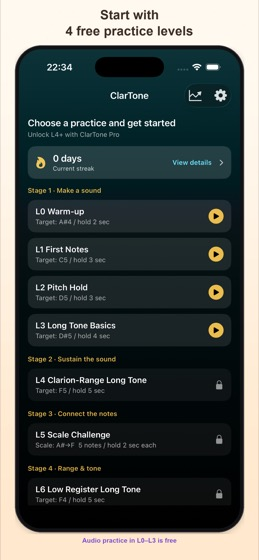
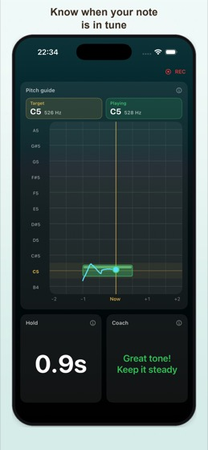
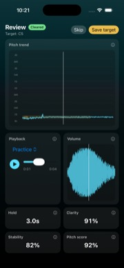
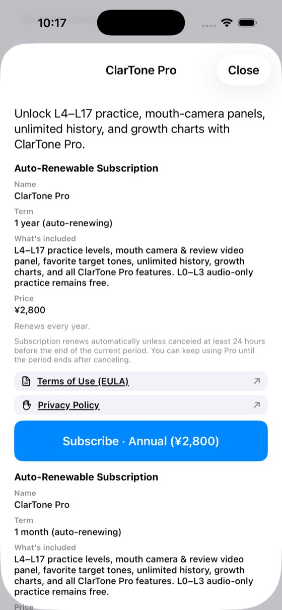

# ClarTone — User Guide

**Version:** 1.0.0  
**Last updated:** 2026-08-06

<a href="guide">日本語</a> · <strong>English</strong>

This page is the user guide for **ClarTone**, a clarinet tone-production practice app. Use it when you want a screen-by-screen walkthrough after the short in-app tutorial (**Settings → Getting started**).

- [Support](support-en)
- [Privacy Policy](privacy-policy-en)
- [Terms of Use](terms-of-use-en)

---

## 1. Choose a practice on Home

Home lists practice levels. **L0–L3 are free**; **L4 and later require ClarTone Pro** (some levels show as Coming soon). Tapping a locked row opens the Pro upgrade sheet.

You can also check your streak and open the progress hub from the chart icon in the top right.

---

## 2. During practice

Confirm the target tone in preview, then Listen → countdown starts the session. The **REC** indicator means the practice session is being recorded.

See [§4 Panel reference](#4-panel-reference) for what each panel means, and [§3 Changing panel layout](#3-changing-panel-layout) to show, hide, resize, or reorder panels.

In Settings you can also adjust the reference pitch (A = 438–445 Hz) and tone-break detection. Target notes use **concert pitch** (sounding pitch).

---

## 3. Changing panel layout

Customize practice and review panels in **Settings → Panel layout**:

1. **Practice panels** — layout during a session  
2. **Review panels** — layout on the review screen  

On each screen you can:

- **Show / hide** panels (at least one main panel stays visible)
- **Size** — Small / Medium / Large
- **Reorder** — drag the control on the right
- **Preview layout** — full-screen check (rotate the device for landscape)
- **Restore default layout** — reset to the initial arrangement

Placement adapts automatically to the screen size. Tap **ⓘ** next to a panel name for a short in-app description.

Turning on a Pro-only panel (such as mouth camera) on the free plan opens the upgrade prompt.

---

## 4. Panel reference

### Practice

| Panel | What it shows |
|--------|----------------|
| Pitch guide | Target pitch band scrolls left, with your played pitch as a trail. Center line is “now”; gold marks the target |
| Goal progress | Long tone: keep time vs goal. Scale: notes cleared vs total |
| Clarity | How clean the tone sounds right now (live) |
| Stability | How steady the pitch is right now (live) |
| Hold | Seconds held inside the target zone |
| Mic input | Input level—if low, move closer or blow more steadily |
| Coach | Short tips (too high/low, near tune, need more sound) |
| Input waveform | Attack and continuity of your sound |
| Harmonic balance | Fundamental and overtones as a tone-clarity cue |
| Scale progress | (Scale levels) How many scale notes you cleared |
| Mouth camera (Pro) | Front-camera view of embouchure / reed area; frame with zoom/pan before practice |

### Review

| Panel | What it shows |
|--------|----------------|
| Playback | This take, favorite (or reference), or both—with a mix slider when playing together |
| Pitch over time | Vertical = pitch, horizontal = time. Light band = target; blue = this take; gold = reference when shown |
| Volume change | Relative loudness over time (not pitch) |
| Hold | Longest keep time in this session |
| Clarity / Stability | Peak values for this session |
| Pitch accuracy | How close you stayed to the target on average |
| Harmonic balance | Clarity / resonance cue |
| This mouth video (Pro) | Mouth/reed video for this session (synced with audio) |
| Favorite mouth video (Pro) | Comparison clip; if none is saved, a sample framing guide is shown |

---

## 5. After practice (review)

When a session ends, the review screen opens with pass/fail, pitch chart, playback, volume envelope, and scores.

You can **register a target tone** you like as a favorite (manage later in **Settings → Practice targets**).

Audio review is available on the free plan. Mouth-camera video panels are Pro.

---

## 6. Reed tracking (ClarTone-specific)

On clarinet, noting which reed you used makes later review easier.

1. Add reeds in **Settings → Reed management** (name, start date, and so on)
2. When a reed wears out, mark it **retired** (archive instead of delete so past history still resolves)
3. Optionally attach the reed you used on the preview or result screen (last choice is the default)

Deeper reed-by-reed analytics are planned for a later update.

---

## 7. ClarTone Pro

Pro unlocks:

- Levels from L4 onward (higher / scale work; some levels may be Coming soon)
- Mouth/reed camera panels and review video panels
- Unlimited history
- Per-level growth charts

Buy or restore in **Settings → Subscription**. Cancel in iOS **Apple ID → Subscriptions**.

---

## 8. Free vs Pro

| Item | Free | Pro |
|------|------|------|
| Levels | L0–L3 | L4+ (except Coming soon) |
| Audio review | Yes | Yes |
| Mouth/reed camera | — | Yes |
| Reed register & session link | Yes | Yes |
| History | Last 5 sessions | Unlimited |
| Growth charts | — | Yes |

---

## 9. Mouth/reed camera (Pro)

- Turn on mouth-related panels in **Settings → Panel layout** (practice / review).
- Free users who enable a Pro panel see the upgrade prompt.
- Video stays on device; it is not uploaded to a developer server.
- Camera permission is requested only when you use the mouth panel. Mic-only practice needs the microphone alone.

---

## 10. Progress and history

- Open the progress hub from the chart icon on Home.
- Streak is available on Free; growth charts are Pro.
- Delete individual or all records in **Settings → Practice history**.

---

## Related pages

- [Support](support-en)
- [Privacy Policy](privacy-policy-en)
- [Terms of Use](terms-of-use-en)
- [Specified Commercial Transactions notice](tokushoho)

---
