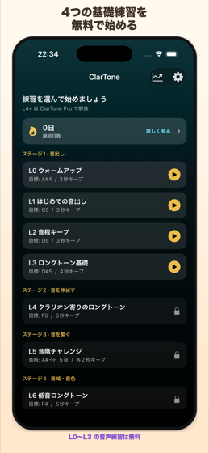
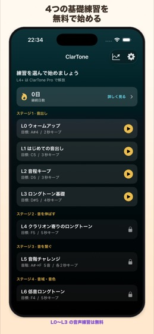
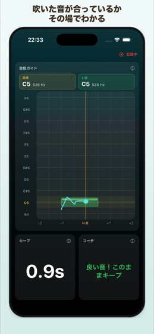
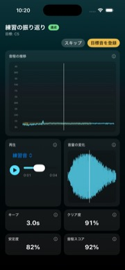
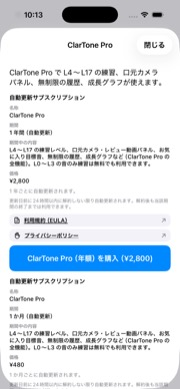

# ClarTone｜クラリネット音出し・ロングトーン練習（使い方ガイド）

**対象バージョン:** 1.0.2  
**最終更新日: 2026-09-12

<strong>日本語</strong> · <a href="guide-en">English</a>

**ClarTone** は、クラリネット初心者の **音出し・ロングトーン** を、マイク入力の **ピッチとキープ秒数** で見える化する iPhone / iPad 用練習アプリです。  
部活やレッスンで「音が出ない」「音程が安定しない」「リードが合わない」ときの補助に使えます。**L0〜L3 は無料**です。

| 場所 | 表示名 |
|------|--------|
| App Store | **ClarTone** |
| ホーム画面 | **ClarTone** |
| アプリ内 | **ClarTone** / **ClarTone Pro** |

**まずはインストール:** [App Store で開く（ClarTone）](https://apps.apple.com/app/id6798112668)  
（下の [アプリを入れる](#アプリを入れる) に QR コードもあります）

本ページは画面つきの操作ガイドです。アプリ内の短いチュートリアル（設定 → 使い方）のあとに、詳しく確認したいときにもご覧ください。

  

## 目次

1. [ホームで練習を選ぶ](#1-ホームで練習を選ぶ)
2. [練習中の見かた](#2-練習中の見かた)
3. [パネルレイアウトの変更](#3-パネルレイアウトの変更)
4. [パネルの説明](#4-パネルの説明)
5. [練習の振り返り](#5-練習の振り返り)
6. [リードの管理](#6-リードの管理clartone-固有)
7. [ClarTone Pro](#7-clartone-pro)
8. [無料と Pro のちがい](#8-無料と-pro-のちがい)
9. [口元／リードカメラ（Pro）](#9-口元リードカメラpro)
10. [進捗と履歴](#10-進捗と履歴)
11. [アプリを入れる](#アプリを入れる)
12. [困ったとき](#困ったとき)

- [サポート（お問い合わせ）](support)
- [プライバシーポリシー](privacy-policy)
- [利用規約](terms-of-use)

---

## 1. ホームで練習を選ぶ

ホームではレベル（L0〜）が一覧表示されます。**L0〜L3 は無料**、**L4〜L13 は ClarTone Pro** です（L14 以降は「開発中」表示）。ロック付きの行をタップすると Pro の案内が開きます。  
各レベルの **ⓘ** から「なぜこの練習か」も読めます（開発中の行は説明文がその内容のため ⓘ はありません）。

継続日数（ストリーク）や、右上のグラフアイコンから進捗ハブも開けます。

---

## 2. 練習中の見かた

プレビューで目標音を確認し、Listen → カウントダウンのあと練習が始まります。画面上部の **記録中** は、練習セッションの記録中であることを示します。  
プレビューには「なぜこの練習か」も表示されます（そのレベルの **初回だけ** 開いた状態で、以降は ⓘ から開けます）。結果画面でも同じ説明を確認できます。

主なパネルの意味は [§4 パネルの説明](#4-パネルの説明) を参照してください。表示のオン／オフや並びは [§3 パネルレイアウトの変更](#3-パネルレイアウトの変更) で変えられます。

設定では基準ピッチ（A=438〜445Hz）や音の途切れ判定も調整できます。目標音は **実音（コンサートピッチ）** ベースです。

---

## 3. パネルレイアウトの変更

練習中・振り返りで使うパネルは、**設定 → パネルレイアウト** から変更できます。

1. **練習中のパネル** … 練習画面の構成  
2. **レビューのパネル** … 振り返り画面の構成  

各画面では次ができます。

- **表示のオン／オフ** … 使わないパネルをオフにできます（主要パネルは最低1つ残ります）
- **大きさ** … 小／中／大
- **並べ替え** … 右側のコントロールをドラッグして順番を変更
- **レイアウトをプレビュー** … いまの配置を全画面で確認（端末を回転すると横向きも確認できます）
- **標準レイアウトに戻す** … 初期配置にリセット

配置は画面サイズに合わせて自動調整されます。パネル名の横の **ⓘ** をタップすると、そのパネルの短い説明もアプリ内で読めます。

口元カメラなど Pro 専用パネルを無料プランでオンにすると、アップグレード案内が表示されます。

---

## 4. パネルの説明

### 練習中

| パネル | 内容 |
|--------|------|
| 音程ガイド | 目標音の帯が左へ流れ、吹いた音の軌跡が重なります。中央の線が「いま」、金色が目標音です |
| 目標の進み具合 | ロングトーンはキープ時間、音階はクリアした音数への進み |
| クリア度 | いまの音のきれいさ（ライブ） |
| 安定度 | いまの音程の安定度（ライブ） |
| キープ | 目標音に乗せている秒数 |
| マイク入力 | 入力の大きさ。低いときは近づくか息を安定させてください |
| コーチ | 高い／低い／近い／音が小さいなどの短い助言 |
| 入力波形 | 立ち上がりや途切れの確認用 |
| 倍音バランス | 基音と倍音の強さの目安 |
| 音階の進み具合 | （音階レベル）クリアした音階の音数 |
| 口元カメラ（Pro） | 前面カメラの口元／リード付近の映像。練習前にズームと位置を合わせます |

### 振り返り（レビュー）

| パネル | 内容 |
|--------|------|
| 再生 | 今回の練習音・お気に入り（または基準音）・同時再生。同時のときはスライダーで混ぜ具合を調整 |
| 音程の推移 | 縦＝音程、横＝時間。薄い帯が目標。青が今回、金色がお手本（表示時） |
| 音量の変化 | 時間に沿った相対的な音量（音程ではありません） |
| キープ | この練習でキープできた最長時間 |
| クリア度 / 安定度 | この練習でのピーク値 |
| 音程の正確さ | 目標に対する平均的な近さ（高いほど正確） |
| 倍音バランス | 音の澄み・響きの目安 |
| 今回の口元（Pro） | この練習の口元／リード動画（音声と同期） |
| お気に入りの口元（Pro） | 比較用。未登録時は撮影ポジションのサンプルを表示 |

---

## 5. 練習の振り返り

練習が終わると振り返り画面が開きます。達成／未達のバッジ、音程の推移、再生、音量の変化、スコアを確認できます。

気に入った吹き方は **目標音を登録** でお気に入りに残せます（あとから設定 → 練習の目標音で管理）。

無料でも音声の振り返りは利用できます。口元カメラの動画パネルは Pro です。

---

## 6. リードの管理（ClarTone 固有）

クラリネットでは、どのリードで吹いたかを残すと振り返りやすくなります。

1. **設定 → リードの管理** でリードを追加（名前・使用開始日など）
2. 使えなくなったら **使用終了** にします（削除せずアーカイブすると、過去の履歴表示が保てます）
3. 練習のプレビューや結果で、使用リードを任意選択できます（前回選択がデフォルト）

リード別の詳しい分析（使用回数・成績・ブランド別マッチ）は **ClarTone Pro** で利用できます。寿命の自動推定はしません。

---

## 7. ClarTone Pro

Pro では次が使えます。

- L4〜L13 の練習（高音・音階・レジスター・スラーなど。L14 以降は開発中表示あり）
- リード分析（使用回数・成績・ブランド別マッチ）
- 口元／リードカメラパネルとレビュー用動画パネル
- 履歴の無制限保存
- レベル別の成長グラフ

購入・復元は **設定 → サブスクリプション** から。解約は iOS の Apple ID → サブスクリプションです。

---

## 8. 無料と Pro のちがい

| 項目 | 無料 | Pro |
|------|------|------|
| レベル | L0〜L3 | L4〜L13（L14以降の開発中を除く） |
| 音声の振り返り | ○ | ○ |
| 口元／リードカメラ | - | ○ |
| リードの登録・紐づけ | ○ | ○ |
| リード分析 | - | ○ |
| 履歴 | 直近 5 件 | 無制限 |
| 成長グラフ | - | ○ |

---

## 9. 口元／リードカメラ（Pro）

- **設定 → パネルレイアウト** の練習中／レビューから口元関連パネルをオンにできます。
- 無料ユーザーが Pro パネルをオンにしようとすると、アップグレード案内が表示されます。
- 映像は端末内で扱い、開発者サーバーへ送信しません。
- カメラ権限は口元パネル利用時に求められます。音のみならマイクだけで足ります。

---

## 10. 進捗と履歴

- ホーム右上のグラフアイコンから進捗ハブを開けます。
- ストリークは無料でも確認できます。成長グラフは Pro です。
- 設定 → 練習記録 から、個別削除や全削除ができます。

---

## アプリを入れる

無料で始められます（L4 以降や口元カメラなどは ClarTone Pro）。

**ストアで開く:** [ClarTone（App Store）](https://apps.apple.com/app/id6798112668)

  

1. iPhone / iPad のカメラで QR を写す → 表示されたリンクをタップ  
2. App Store で **入手**（または **再ダウンロード**）をタップ

検索で探すときは App Store で **「ClarTone」** または **「クラリネット 音出し」** と入力しても見つかります。

---

## 困ったとき

| 状況 | 対処 |
|------|------|
| ピッチが反応しない | マイク権限を許可。息を安定させて近づける。設定で基準ピッチ（A）を確認 |
| Pro を買ったのに使えない | 設定 → サブスクリプション → **購入を復元する** |
| カメラが出ない | Pro 契約とパネルレイアウトで口元パネルがオンか確認。カメラ権限を許可 |
| 記録を消したい | 設定 → 練習記録 |

その他の質問は [サポート](support) をご覧ください。

---

## 関連ページ

- [サポート](support)
- [プライバシーポリシー](privacy-policy)
- [利用規約](terms-of-use)
- [特定商取引法に基づく表記](tokushoho)
- [English User Guide](guide-en)

---
